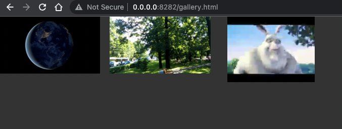

# Video Gallery Generator
The command line application generates thumbnails for videos and run the builtin WebServer to serve the HTML gallery and play the videos.

Check the [releases](https://github.com/gadelkareem/video-gallery-generator/releases) page for executable versions.

By default, the application will only run the server on http://0.0.0.0:8282/. To generate thumbnails for all videos in a directory, use the `-g` option.

# Usage
```bash
# Run the server using current directory as the root directory
./vgg-darwin-arm64 
# Run the server using current directory as the root directory and generate thumbnails for all videos in the current directory
./vgg-darwin-arm64 -g
# Run the server using a specific path as the root directory and different port
./vgg-darwin-arm64 -d /path/to/videos -p 8080
```

# Build for all platforms
```shell
./build.sh
```